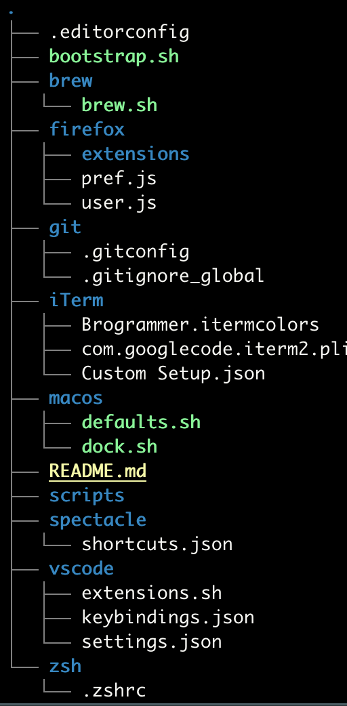

## My dotfiles

These are my dotfiles.
They are very much specific to my use case and needs, but feel free to use them if it also matches your needs.


## Overview


* Target System: macOS
* Target Profile: Profile usage mainly for JVM Software Development
* Status of these dotfiles: WIP

### Main Dependencies
* [AWS CLI](https://aws.amazon.com/cli/)
* [CF CLI](https://docs.cloudfoundry.org/cf-cli/)
* [Gradle](https://gradle.org/)
* Git & related tools (git-crypt, git-extras, git-secrets)
* [Java 11 from AdoptOpenJDK](https://adoptopenjdk.net/)
* [JMeter](https://jmeter.apache.org/)
* [jenv](https://github.com/jenv/jenv)
* [jq](https://stedolan.github.io/jq/)
* [Kotlin CL Compiler](https://kotlinlang.org/docs/tutorials/command-line.html)
* [Maven](https://maven.apache.org/)
* [Spring Boot CLI](https://docs.spring.io/spring-boot/docs/current/reference/html/spring-boot-cli.html)
* [Spring Cloud CLI](https://cloud.spring.io/spring-cloud-cli/reference/html/)
* [zsh](https://ohmyz.sh/)
* And many other tools...

### GUI Apps
* [iTerm](https://www.iterm2.com/)
* [Postman](https://www.postman.com/)
* [Firefox](https://www.mozilla.org/en-US/firefox/new/?redirect_source=firefox-com)
* [VSCode](https://code.visualstudio.com/)
* [Spotify](https://www.spotify.com/pt/)
* [MacPass](https://macpassapp.org/)
* [Clippy](https://github.com/Clipy/Clipy)
* [Slack](https://slack.com/)
* [Spectacle](https://www.spectacleapp.com/)

### Custom aliases

```bash
alias hosts="sudo $EDITOR /etc/hosts"
alias copyssh="more ~/.ssh/id_rsa.pub | pbcopy | echo 'SSH Public key copied to clipboard.'"
alias copygpg="gpg --armor --export <your-email-here> | pbcopy | echo 'GPG Public key copied to clipboard.'"
alias reloadzsh="source ~/.zshrc"
alias configzsh="code ~/.zshrc"
alias ~="cd ~"
```

## Installation

```bash
source bootstap.sh
```

## Credits

* [Getting Started With Dotfiles](https://medium.com/@webprolific/getting-started-with-dotfiles-43c3602fd789)
* [Dotfiles Are Meant to Be Forked](https://zachholman.com/2010/08/dotfiles-are-meant-to-be-forked/)
* [@mathiasbynens and his dotfiles](https://github.com/mathiasbynens/dotfiles)
* [@xbitres and his dotfiles](https://github.com/xbitres/.dotfiles)
* [@pandrez for letting me know about this](https://github.com/pandrez)